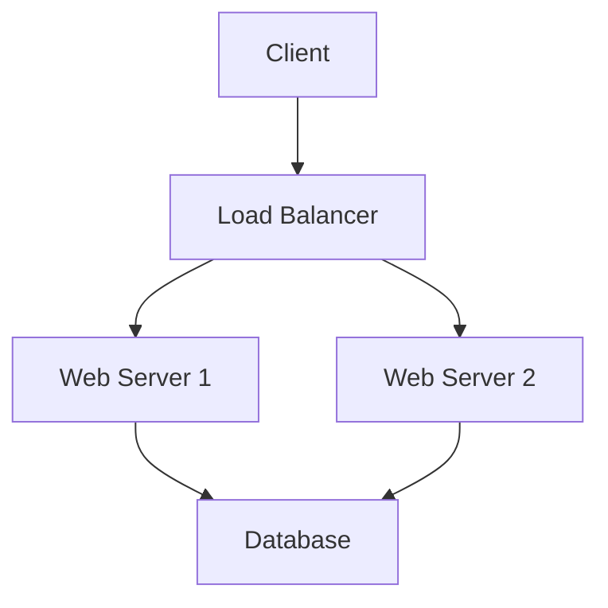

# System Design Fundamentals

Transform your understanding of large-scale systems and ace your senior engineer interviews with this comprehensive system design course.

## What You'll Learn

This course covers everything you need to know about designing scalable, reliable, and maintainable systems:

### Core Concepts
- **Scalability**: Horizontal vs Vertical scaling
- **Reliability**: Fault tolerance and disaster recovery  
- **Consistency**: CAP theorem and eventual consistency
- **Performance**: Latency, throughput, and optimization

### System Components
- Load balancers and reverse proxies
- Databases: SQL vs NoSQL, sharding, replication
- Caching strategies: Redis, Memcached, CDN
- Message queues and event streaming

## Course Structure

### Module 1: Foundations (Weeks 1-2)
Learn the building blocks of distributed systems:

- System design principles
- Back-of-envelope calculations
- Common architectures and patterns

### Module 2: Storage & Databases (Weeks 3-4)
Master data storage solutions:

- **SQL Databases**: ACID properties, indexing, query optimization
- **NoSQL Databases**: Document, key-value, graph, column-family
- **Database Scaling**: Read replicas, sharding strategies, federation

### Module 3: Caching & Performance (Weeks 5-6)
Optimize system performance:

- Cache patterns: Cache-aside, write-through, write-back
- Content Delivery Networks (CDN)
- Application-level caching strategies

### Module 4: Real-World Case Studies (Weeks 7-8)
Design complete systems:

> **Case Study 1**: Design Twitter
> - Timeline generation
> - Tweet storage and retrieval
> - User relationships and social graph
> 
> **Case Study 2**: Design YouTube  
> - Video upload and encoding pipeline
> - Global content distribution
> - Recommendation system architecture

## Key Learning Outcomes

After completing this course, you'll be able to:

1. ✅ **Approach any system design problem** systematically
2. ✅ **Make informed trade-offs** between different architectural choices  
3. ✅ **Scale systems** from thousands to millions of users
4. ✅ **Communicate technical concepts** clearly in interviews

## Interview Preparation

### Common Questions Covered:
- Design a URL shortener (like bit.ly)
- Design a chat system (like WhatsApp)
- Design a news feed system (like Facebook)
- Design a video streaming service (like Netflix)
- Design a ride-sharing service (like Uber)

### Evaluation Framework:
1. **Requirements gathering** (5 minutes)
2. **High-level design** (15 minutes)  
3. **Detailed component design** (15 minutes)
4. **Scale and optimize** (15 minutes)
5. **Handle edge cases** (10 minutes)

## Prerequisites

- 3+ years of software development experience
- Understanding of basic data structures and algorithms
- Familiarity with web development concepts
- Basic knowledge of databases and networking

## Tools & Technologies

You'll work with modern tools used in production systems:

- **Databases**: PostgreSQL, MongoDB, Redis, Elasticsearch
- **Message Queues**: Apache Kafka, RabbitMQ, Amazon SQS
- **Monitoring**: Prometheus, Grafana, ELK Stack
- **Cloud Services**: AWS, Google Cloud, Azure

---

## Enrollment Information

**💰 Price**: $299 (Early bird: $199 until Feb 1st)  
**⏰ Duration**: 8 weeks, 3-4 hours per week  
**📚 Materials**: Video lectures, hands-on labs, design templates  
**🎓 Certificate**: Completion certificate included  

### What's Included:
- 24 comprehensive video lessons
- Interactive system design templates
- 1-on-1 mock interview session
- Private Discord community access
- Lifetime access to course materials

[**Enroll Now →**](/courses/enroll/system-design-fundamentals)

---

*Questions about the course? [Contact our team](/contact) or check our [FAQ](/faq).*